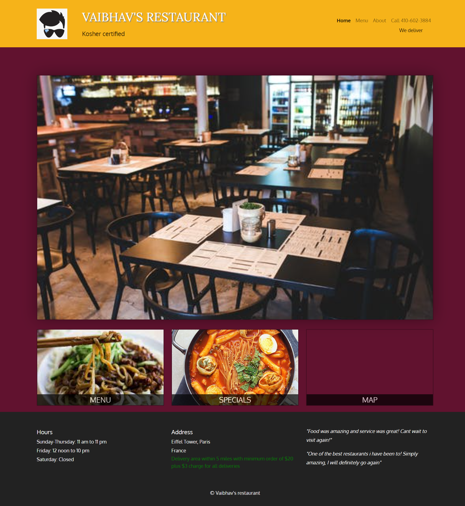
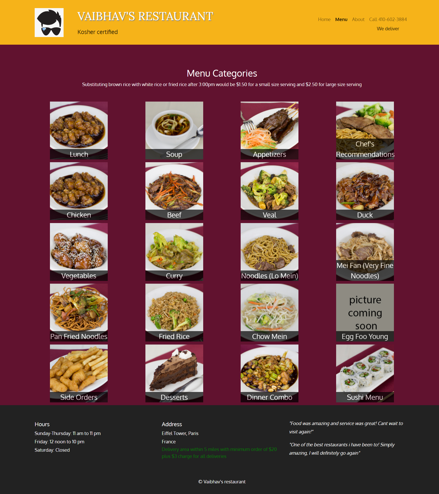
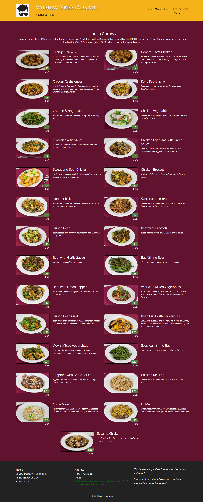

# Restaurant Web App

Engineered a feature-rich, responsive restaurant website using `HTML, CSS, Bootstrap, JQuery, and JavaScript`, seamlessly integrating custom loaders for optimal user experience and employing `AJAX requests` to dynamically retrieve and JavaScript, along with JQuery, to populate data from `REST APIs`.

Showcased expertise in front-end development by implementing an interactive main page with a dynamic carousel, strategic links to menu categories, and an `embedded Google Maps`, ensuring a visually appealing and engaging user interface through strategic integration of JavaScript and JQuery.

Drove user engagement and satisfaction by meticulously curating and populating an extensive `dynamic` menu of over `500 items across 20 categories`, leveraging JSON data manipulation, JavaScript, JQuery, and `responsive` design principles for a seamless browsing experience.

## Try it Out

- [Restaurant Link](https://vaibhav-thalanki.github.io/restaurant/)

## Images

    1. Main Page

    2.  Menu Categories Page

    3.  Menu Items Page

